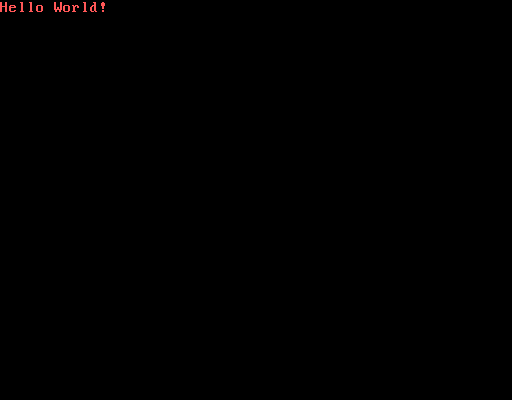
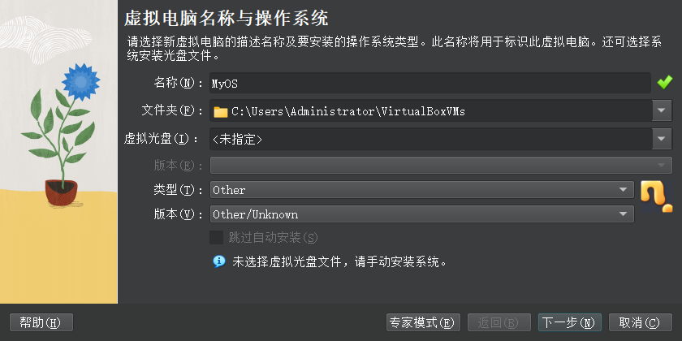
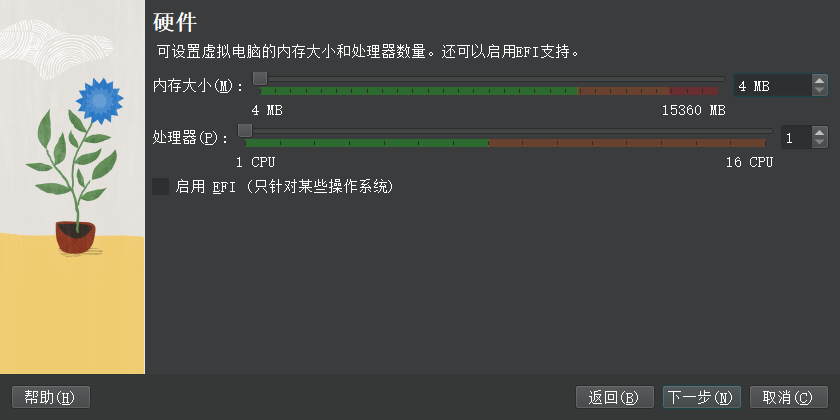
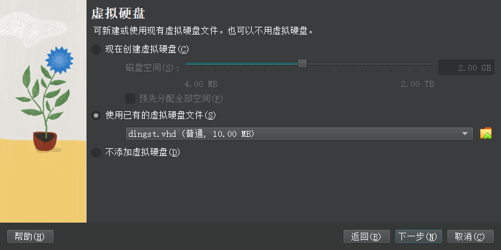

# my-Kernel

制作一个自己的操作系统内核
Starting time:20240326

## 环境搭建

Nasm：汇编

虚拟机

Windows10 /11

手动生成虚拟磁盘

```shell
Diskpart
create vdisk file=C:\dingst.vhd maximum=10 type=fixed # 在C盘生成一个虚拟磁盘也可以在其他盘
```

**ps:所有使用的工具在每一章文件夹里都可以找到**

## Episode 1 —— 在裸机实现HelloWorld 

如图：



**ps:这是你实现自己的操作系统的第一步，也许会遇到很多坑，非常非常需要耐心！**

### 新建一个hello.asm文件

```sh
org 07c00h
mov ax,cs
mov ds,ax
mov es,ax
call Disp
jmp $
Disp:
    mov ax,BootMsg
    mov bp,ax
    mov cx,16
    mov ax,01301h
    mov bx,000ch
    mov dx,0
    int 10h
BootMsg: db "Hello World!"
times 510 - ($-$$) db 0
dw 0xaa55
# 后面再做详细解释
```

### 使用**nasm**编译汇编文件hello.asm

```sh
nasm ../hello.asm -o boot.bin # 手笨的小伙伴我已经提供好汇编代码和编译后的文件了  ./Episode1
## 使用dd命令写入磁盘
dd if=boot.bin of=C:\\dingst.vhd bs=512 count=1 #从名为 "boot.bin" 的文件中读取512字节的数据，并将其写入到位于 "C:\dingst.vhd" 的文件中
```

### 使用虚拟机调试

我用的虚拟机是VirtualBox（**用真机也是同样效果,不过我条件有限，各位大佬可以试试**）

新建虚拟机（类型和版本最好跟我一样）



下一步内存使用4MB



选择使用现有的虚拟硬盘文件然后选中最开始你创建的那个虚拟磁盘（别告诉我你忘记你创建了磁盘了）



最后启动虚拟机，恭喜你完成了你操作系统内核的一小步！！


### 扩展
